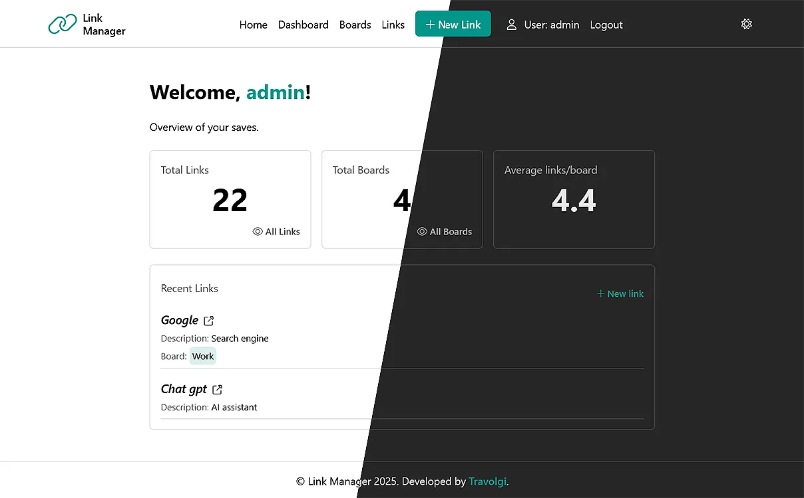

# Link Manager - MVC application 

A lightweight PHP MVC application for managing boards and links.  
Includes **registration** system, **protected login**, **private dashboard** and CRUD management of boards, links and tags.
This project demonstrates a simple yet structured approach to full-stack development using an MVC architecture.



## Table of contents

- [Features](#features)
- [Technologies](#technologies)
- [Requirements](#requirements)
- [Installation](#installation)
- [Project structure](#project-structure)
- [Usage and system logic](#usage-and-system-logic)
- [Bugs](#bugs)
- [Future developments](#future-developments)
- [Contributing](#contributing)
- [Author](#author)
- [License](#license)


## Features

- User Registration & Login System (with session handling)
- Protected Dashboard accessible only to authenticated users
- Board, Link and Tag Management (create, read, update, delete)
- Keyword search and sorting filters
- Clean MVC structure for easy maintainability
- Dark/light UI theme saved on localstorage


## Tech Stack

- **PHP 8+** (Backend - Core application logic)
- **MySQL** (Database - Data storage)
- **HTML5 / TailwindCSS** (Frontend rendering)
- **Vanilla JavaScript** (Basic interactivity)
- **MVC Architecture** (Model-View-Controller)  
- **Server:** Apache/Nginx with PHP support


## Requirements

- PHP >= 8.0
- MySQL >= 5.7
- Web server (Apache recommended with `mod_rewrite` enabled)


## Installation

1. Clone the repository:
   ```bash
   git clone https://github.com/travolgi/link-manager.git
	cd link-manager
   ```

2. Import the `schema.sql` file into your MySQL database.

3. Configure the database connection inside `config/config.php`.
	```
	define('DB_HOST', 'localhost');
	define('DB_NAME', 'link_manager');
	define('DB_USER', 'your_user_db');
	define('DB_PW', 'your_db_password');
	```

4. Start a local PHP server -> Go to `http://localhost`.

5. Launch TailwindCss Cli from the terminal to make style changes 
	```
	npx @tailwindcss/cli -i ./public/assets/css/input.css -o ./public/assets/css/style.css --watch
	```


## Project Structure

```
/ (root)
│	├── app/
|  |  ├── config/
|  |  |   ├── config.php                     # App constant
|  |  │   └── db.php                         # Database connection
|  |  │
|  |  ├── controllers/
|  |  │   ├── AuthController.php             # Login/Registration Management
|  |  │   ├── BoardController.php            # Board Management
|  |  │   ├── DashboardController.php        # Dashboard Management
|  |  │   └── LinkController.php             # Link Management
|  |  │
|  |  ├── core/
|  |  │   ├── Controller.php                 # Base controller
|  |  │   └── Model.php                      # Base model
|  |  │
|  |  ├── helpers/
|  |  │   ├── date_format.php                # Format date
|  |  │   ├── Security.php                   # Csrf token for form
|  |  │   ├── slugify.php                    # Create slug from string
|  |  │   └── current_user_id.php            # Get current user ID from session
|  |  │
|  |  ├── models/
|  |  │   ├── BoardModel.php                 # Board query
|  |  │   ├── LinkModel.php                  # Link query
|  |  │   └── UserModel.php       	         # User/Auth query 
|  |  │
|  |  └──  views/
|  |      ├── partials/                      # UI components
|  |      |   ├── field_select_board.php
|  |      |   ├── field_select_orderby.php
|  |      |   ├── header.php
|  |      |   ├── footer.php
|  |      |   ├── link_filters.php           # Filters component
|  |      |   └── link_modal.php             # Modal create link
|  |      ├── boards.php                     # Boards page
|  |      ├── dashboard.php                  # Dashboard page
|  |      ├── edit_board.php                 # Edit board page
|  |      ├── edit_link.php                  # Edit link page
|  |      ├── layout.php                     # Main layout
|  |      ├── links.php                      # Links page
|  |      ├── login.php                      # Login page
|  |      └── register.php                   # Register page
|  |   
│	├── node_modules/
|  |
|  └── public/
│     ├── assets/                            # Static files
|     |   ├── css                            # css styles
|     |   ├── fonts
|     |   ├── imgs
|     |   └── js                             # js scripts
│     └── index.php                          # Router
│
├── .gitignore
├── LICENSE
├── package-lock.json
├── package.json
├── README.md
└── schema.sql                               # Database SQL schema
```


## Usage and system logic

- Register a new account or log in with existing credentials.
- Access the dashboard to manage your links, tags and boards.
- Logout when finished.

[UX processes and system logic - FigJam](https://www.figma.com/community/file/1550187983633712159)


## Bugs

Please feel free to create an issue if you see a bug or something unexpected in the app.


## Future developments

- Password reset functionality
- Link categorization and tags
- Async update (fetch) for updates/deletes without reloading.
- Drag & Drop frontend functionality 
- Responsive design improvements
- Save dark/light UI theme on database
- REST API: endpoint construction


## Contributing

- Fork the Project
- Create your Feature Branch (`git checkout -b feature/yourFeature`)
- Commit your Changes (`git commit -m 'Brief explanation of feature`')
- Push to the Branch (`git push origin feature/yourFeature`)
- Open a Pull Request


## Author

Developed by [Travolgi](https://github.com/travolgi)


## License

This project is licensed under the [MIT license](https://github.com/travolgi/mini-blog/blob/main/LICENSE) - see the LICENSE file for details.